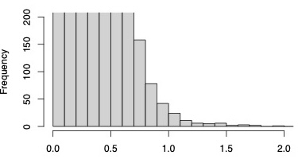

# Sequence alignment, gene tree inference, data cleaning

Sequence data cleaning, alignment, and gene tree inference were conducted with the following steps:

## I. Data cleaning

1. First-round alignment + tree inference
  
   Use the mafft-linsi algorithm to align DNA sequences, trim with trimAL (-gt 0.10), a preliminary phylogeny with FastTree, then removing outgroup sequences (non-Malpighiales) with `get_outgroup.py`. A first-round thorough search for maximum likelihood gene trees was conducted with IQTREE (1000 ultrafast bootstrap replication and optimal models determined by ModelFinder). The bash script to run these analyses altogether for each gene is provided in `mafft_trimal_fasttree_iqtree.sh`.

2. Use the pipeline from Yang and Smith (2016) to remove paralogs and create one-to-one ortholog for the cleaned dataset with at least 10 species.

```
python yangya-phylogenomic_dataset_construction-489685700c2a/prune_paralogs_RT.py test/ .treefile na_tree_yang_pruned/ 10 malp.taxa
```
This resulted in 2135 orthogroups for final phylogenetic investigation. Newly added orthologous Apodanthaceae for each orthogroup is included in `orthologous_apodanthaceae.tsv`.

In addition, we plotted the distribution of root-to-tip distance for all species (see below) and identified 1.5 as a natural break for outliers. Then all sequences with root-to-tip distance longer than 1.5 were removed using `prune_long_branch_retain_ortho_Apo.py`.



3. Second round alignment

   Use the mafft-ensi algorithm to align **RAW** AA sequences (untrimmed), back translate to DNA codon alignment
```
mafft --genafpair --maxiterate 1000 aa.fas > aa.aln.fas
pal2nal.pl aa.aln.fas na.fas -output fasta > na.aln.fas

```

## II. Alignment masking

4. Alignment masking with HmmCleaner

Use the `HmmCleaner.pl` from [MACSE_ALFIX_V01](https://github.com/ranwez/MACSE_V2_PIPELINES/tree/master) to remove non-homologous regions in the alignment. I have difficulty installing HmmCleaner from cpan or source, but it was contained in the MACSE pipeline. A threshold of 50 and 10 was used to generate alignments with standard and more stringenet filtering, respectively. **Only the standard masking with a threshold of 50 was used for gene tree inference. The stringent threshold of 10 was only used for concatenation.** HmmCleaner directly deletes the regions, which will break the codon position. So I write a custom Python script `hmmcleaner_codon_aware_masking.py` to take in the log file from HmmCleaner and mask the corresponding position in the alignment.

```
perl MACSE_ALFIX_V01/HMMcleanerV1_8_VR2/HMMcleanNuc_VR.pl 2675.na.aln.fas 50
python hmmcleaner_codon_aware_masking.py 2675.na.aln.fas 2675.na.aln_Hmm50.log 

```
or for protein alignments
```
perl MACSE_ALFIX_V01/HMMcleanerV1_8_VR2/HMMcleanNuc_VR.pl 2675.aa.aln.fas 50
python hmmcleaner_codon_aware_masking.py 2675.aa.aln.fas 2675.aa.aln_Hmm50.log 
```

This will generate *.masked.fas for each fasta file, with all sites flagged by HmmCleaner masked ('N' for DNA and '?' for protein).

## III. Gene tree inference

5. Final maximum likelihood gene trees inference.

We inferred ML phylogenies for each locus based on five combinations of DNA partitioning strategies and substitution models using IQ-TREE v2.3.6 (Minh et al. 2020b). Branch support evaluated with 1000 ultrafast bootstrap replication, -bnni to reduce the risk of overestimating branch supports. These ML inferences included:

(1) codon-based partition and forcing the GTR substitution model without rate heterogeneity across sites (i.e., no +I or +R or +G); 

```
iqtree2 -T 2 -s $ID.na.mask.fas -m GTR -p $ID.partition --prefix $ID.GTR_codon -B 1000 -bnni 
```

(2) codon-based partition and forcing the GTR substitution model with rate heterogeneity across sites; 

```
iqtree2 -T 2 -s $ID.na.mask.fas -p $ID.partition -mset GTR --prefix $ID.msetGTR_codon -B 1000 -bnni 
```

(3) codon-based partition and using the optimal substitution models determined by ModelFinder (Kalyaanamoorthy et al. 2017); 

```
iqtree2 -T 2 -s $ID.na.mask.fas -b 100 -m MFP+MERGE --prefix $ID.MFP_codon -B 1000 -bnni 
```

(4) no partition within loci and forcing the GTR substitution model with rate heterogeneity across sites; 

```
iqtree2 -T 2 -s $ID.na.mask.fas -mset GTR --prefix $ID.msetGTR -B 1000 -bnni 
```

(5) no partition within loci and using the optimal substitution models determined by ModelFinder. 

```
iqtree2 -T 2 -s $ID.na.mask.fas --prefix $ID.MFP -B 1000 -bnni
```
