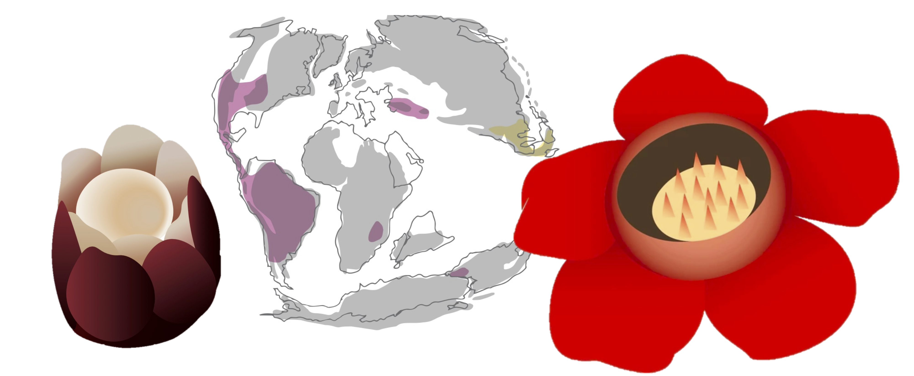

# Rafflesiaceae_phylogenomics
This repository contains scripts for the phylogenomic study of Rafflesiaceae and Apodanthaceae. If you have any questions, feel free to reach out to Liming Cai daybreak.chua@gmail.com

Citation: Liming Cai, Liang Liu, Charles C Davis. The danger zone: the joint trap of incomplete lineage sorting and long-branch attraction in placing Rafflesiaceae. In review.

Subfolders:

## 1_Data_merging

Commands and scripts used to merge phylogenomics datasets from Cai et al. (2019), Cai et al. (2021), and newly generated RNA seq data from Apodanthaceae in order to investigate the placement of Rafflesiaceae+Apodanthaceae.

## 2_Alignment_geneTree

Sequence data cleaning, alignment, and gene tree inference. Software used: MAFFT, TrimAL, HmmCleaner, IQTREE, and custom scripts.

## 3_gene_shopping

Command line and custom scripts to extract phylogenetic properties of individual genes. Software used: IQTREE, SortaDate, and custom scripts.

## 4_phylogeny_hypo_generation

Command lines to infer species tree under the concatenation and coalescent models.

## 5_Topology_test

Testing alternative placements of Rafflesiacaee under the concatenation and coalescent models.

## 6_Time_tree 

Inferring the placement of Rafflesiaceae under the full coalescent model in starBEAST with a reduced dataset.

## 7_MSC_simulation

Simulating sequence under the multi-species coalescent model using empirical parameters to test whether we can confidently resolve the placement of Rafflesiaceae with the amout of data available.

For details, see the README file in each subfolders.
